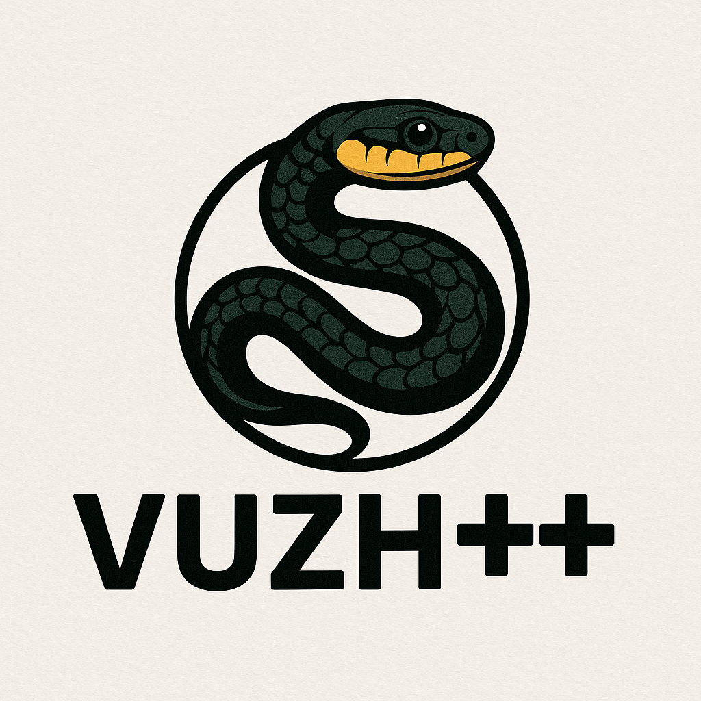

# Vuzh++ programming language

<div align="center">
  
</div>

A tiny compiled programming language created for student learning.

Source code is compiled to the intermediate low-level language, which is then interpreted by a virtual machine.

Supports:
- variables
- expressions
- loops
- conditional blocks
- functions
- multidimensional arrays
  - with `len` operator
  - indexing starting from 1
  - can be passed and returned from functions (by value)
  - sparse internally and are allocated element-by-element
- expression temporary variable number optimization
- input/output from the console
- input/output from file (isolated float values or arrays (input only for 1D/2D and output for any dimensions))
- only one basic type: float

## Compilation and execution
Save your code in `.vu` file (for example in the same folder where compiler is located) and then pass it to the compiler. On Windows:
```bash
python vuzh++compiler.py .\examples\my_src_code.vu
```
It will create `my_src_code.vuc` file, which you can run on the VM:
```bash
python vuzh++vm.py .\examples\my_src_code.vuc
```

**(!)** You can find some code sample in the repo to explore the syntax.

## Syntax highlighting for `.vu` files in VS Code

There is extension available in the folder `vsc_syntax_highlighting_extension`. For the simplest case just execute command to run VS Code with provided full path to that folder. For example on Windows:
```bash
code --extensionDevelopmentPath="<FULL_PATH_TO_THIS_FOLDER>\vsc_syntax_highlighting_extension"
```

## Notes

Language is created for educational purposes.

Currently, it lacks error handling and syntax checks with hints.


*Copyright (c) 2025 Roman Drebotiy*

*Licensed under the Apache License 2.0 (see LICENSE file)*